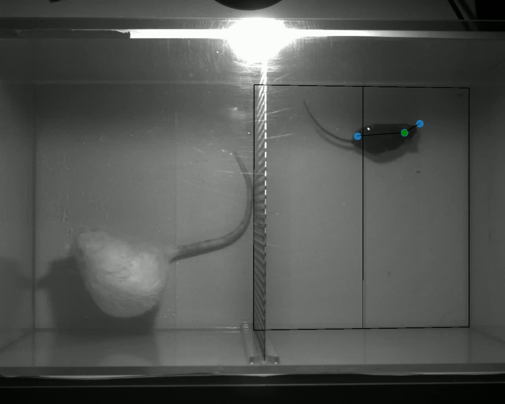

# Contextual modulation and blunted defensive responses to predators in head-fixed and freely moving mice

## Abstract
Behavioral responses to threats - such as fleeing, freezing, or fighting - can be either innate or shaped by learning and context. Here, we investigated whether mice exhibit fear of predators across four experimental contexts: one in a novel head-fixed condition and three in established, freely moving scenarios. In head-fixed mice, we measured the behavioral outcome and response to a live rat. Mice were water-deprived and habituated to walk on a treadmill that controlled a virtual environment and reward delivery. After meeting performance criteria, baseline data were collected in one session, followed by a test session in which the mice were exposed to a live rat. Despite the presence of the predator, most (5 out of 7) mice continued to forage at baseline levels; however, individual mice showed significant alterations in one or more of the following measures: running speed, pupil size, eye movement, and posture. To assess how behavioral context and physical restraint influence predator responses, we exposed 36 naive, freely moving mice to fear-inducing stimuli - including looming visual cues, rat odor, and a live rat. Even in these conditions, a substantial proportion of mice failed to exhibit classical defensive responses such as avoidance or escape. Notably, when presented with a freely moving rat, only about half of the mice displayed avoidance behavior. Together, these findings suggest that mice do not universally express innate fear behaviors such as avoidance or fleeing, even in ethologically relevant predator encounters. Instead, their responses appear to be context-dependent and variable, challenging common assumptions about automatic defensive reactions in rodents.

## Related files
The preprint can be found at https://www.biorxiv.org/content/10.1101/2025.06.09.658679.

The necessary data can be found at https://doi.org/10.5281/zenodo.15264865.
The root_dir variable in each notebook needs to be changed to the location of the data root dir.

Extended data and code are available on request.
